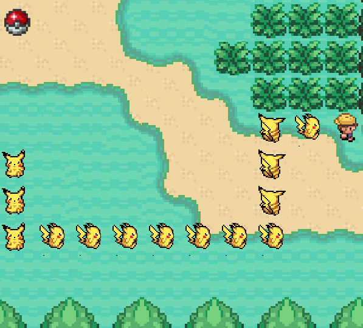

#Ekans

Ekans is a Pokemon-themed variation of the classic Snake game using the `up`, `down`, `left`, and `right` keys. [Play it here!](eka.nz)

##Highlights
* Adds and removes CSS classes with asynchronous `setTimeout` method calls to produce the animated effect.
* Uses efficient JQuery logic that only triggers new classes when absolutely necessary. This results in a really fast game, despite the high level of animation and movement.
* Sprites are animated with sprite sheets in order to prevent flashing and reduce the number of `GET` requests.

##TODO
- [x] Add the ability to reset the game without refreshing.
- [x] Remove fixed width: allow the game to automatically scale to the size of the `window`.
- [x] Add a score counter.
- [ ] Add a leaderboard.
- [ ] Make sprites less "wiggly".  
